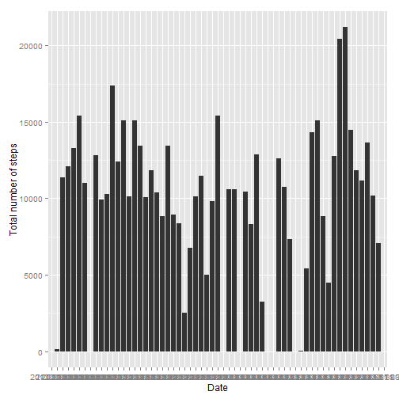
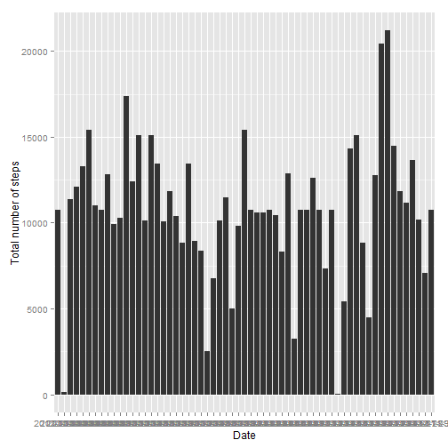

##Reproducible Research: Peer Assessment 1
###Loading and preprocessing the data

####1. Load the data

```r
library(data.table)
```

```
## data.table 1.9.4  For help type: ?data.table
## *** NB: by=.EACHI is now explicit. See README to restore previous behaviour.
```

```r
library(lattice)
library(ggplot2)
library(plyr)
data=fread("./activity.csv")
```
    
  
###What is mean total number of steps taken per day?  
####1. Make a histogram of the total number of steps taken each day

```r
    Steps=data[,list(Total=sum(steps)), by= date]
    qplot(date, Total, data=Steps, geom="bar", stat="identity", xlab=("Date"), ylab=("Total number of steps"))
```

```
## Warning: Removed 8 rows containing missing values (position_stack).
```

 
  
####2. Calculate and report the mean and median total number of steps taken per day  
Mean total number of steps taken per day is

```r
mean(Steps$Total, na.rm=TRUE)
```

```
## [1] 10766.19
```
  
Median total number of steps taken per day is

```r
median(Steps$Total, na.rm=TRUE)
```

```
## [1] 10765
```
                
###What is the average daily activity pattern?      

####1. Make a time series plot (i.e. type = "l") of the 5-minute interval (x-axis) and the average number of steps taken, averaged across all days (y-axis)  

```r
    stepsInterval <- aggregate(steps ~ interval, data = data, mean, na.rm = TRUE)
    plot(steps ~ interval, data = stepsInterval, type = "l")
```

 

####2. Which 5-minute interval, on average across all the days in the dataset, contains the maximum number of steps?  

```r
stepsInterval[which.max(stepsInterval$steps), ]$interval
```

```
## [1] 835
```

###Input missing values

####1. Calculate and report the total number of missing values in the dataset (i.e. the total number of rows with NAs)  

```r
    sum(is.na(data$steps))
```

```
## [1] 2304
```

####2. Devise a strategy for filling in all of the missing values in the dataset and create a new dataset that is equal to the original dataset with the mean for that 5-minute interval filled in the missing values


```r
    datafill <- data  # Make a new dataset with the original data

    datafill$steps <- mapply(function(steps, interval) 
            if (is.na(steps)) 
                stepsInterval[stepsInterval$interval == interval, 2]
            else
                steps, datafill$steps, datafill$interval)
```

####3. Make a histogram of the total number of steps taken each day

```r
    qplot(date, steps, data=datafill, geom="bar", stat="identity", xlab=("Date"), ylab=("Total number of steps"))
```

 


####4.Do these values differ from the estimates from the first part of the assignment?  
The mean of the data without NAs is the same as the data with NAs and median of the data without NAs is different from the data with NAs.  

####5. What is the impact of inputing missing data on the estimates of the total daily number of steps?  
It introduces bias into the calculations or summaries of the data.  

        
###Are there differences in activity patterns between weekdays and weekends?
####1. Create a new factor variable in the dataset with two levels - "weekday" and "weekend" indicating whether a given date is a weekday or weekend day.  

```r
    datafill$date <- as.Date(datafill$date, format="%Y-%m-%d")
    datafill$wday <- as.factor(ifelse(weekdays(datafill$date) %in% c("Saturday","Sunday"), "Weekend", "Weekday")) 
    total_num_steps_per_wday <- ddply(datafill,.(interval, wday),summarise, mean_steps=mean(steps))
```

####2. Make a panel plot containing a time series plot (i.e. type = "l") of the 5-minute interval (x-axis) and the average number of steps taken, averaged across all weekday days or weekend days (y-axis).

```r
    xyplot(mean_steps ~ interval | wday, data = total_num_steps_per_wday, layout = c(1, 2), ylab = "Number of Steps", xlab = "Interval", type = 'l')
```

 


